# GlassWake

**When reality changes, the right agents wake up.**

A company changed its returns policy from 30 days to 14. The authoritative
source knows. The storefront does not. GlassWake detects that drift, wakes only
the agents responsible for what may now be wrong, proves what is stale, repairs
only what it is authorized to touch, and refuses to close until an independent
verifier confirms the repair by fresh reading.

- **Category:** Fortified Enterprise Fleet
- **Live backend:** Cloud Run revision `glasswake-kanon-pulse-00007-z2r` (`us-central1`)
- **Architecture records:** [`docs/adr/`](docs/adr/) · **Invariant coverage:** [`docs/CONFORMANCE.md`](docs/CONFORMANCE.md)

## The architectural thesis

> GlassWake separates what an agent observes, what a model infers, what the
> system believes, what authority permits, what an adapter changes, what an
> independent verifier proves — and what downstream models are merely allowed to
> communicate.

Seven invariants, each enforced at runtime and covered by a named test in
[`docs/CONFORMANCE.md`](docs/CONFORMANCE.md):

1. Model output is not canonical state.
2. Observation is not inference.
3. Inference is not authority.
4. Authority is not execution.
5. Execution is not verification.
6. Repair cannot self-certify.
7. Unaffected systems remain untouched.

## Architecture

```mermaid
flowchart TD
    CHANGE[Change event<br/>returns window 30 → 14] --> GEMMA

    subgraph CANDIDATE[Candidate plane · no authority]
        GEMMA["Gemma 4 Wake Triage<br/><i>gemma-4-26b-a4b-it-maas</i><br/>CANDIDATE ONLY"]
    end

    GEMMA -->|candidate| VALID{{Deterministic validation<br/>non-canonical zones dropped}}
    VALID --> SENTINEL

    subgraph CORE[Governed trust core · Cloud Run]
        SENTINEL[Change Sentinel<br/>Google ADK] --> SCOPE[Impact scope<br/>5 affected · 7 safely skipped]
        SCOPE --> POLICY[Policy Agent]
        SCOPE --> DATA[Data Agent]
        SCOPE --> STORE[Storefront Agent]
        POLICY --> SPINE
        DATA --> SPINE
        STORE --> SPINE
        SPINE[["Evidence Spine<br/>OBSERVED · DECLARED<br/>INFERRED · APPROVED · VERIFIED"]] --> GATE
        GATE{Authority Gate<br/>3 authorized paths}
        GATE -->|BLOCK| DENIED[No mutation]
        GATE -->|REPAIR_1| ADAPTER[Bounded adapter<br/>1 mutation path]
        ADAPTER --> VERIFIER[Independent Verifier<br/>fresh read · no implementer narrative]
        VERIFIER --> RECEIPT[[Sealed receipt<br/>SHA-256 deterministic]]
    end

    GEMINI["Gemini 3.7 Flash<br/>structured review<br/>fail-closed post-validation"] -.reasoning only.-> SPINE
    RECEIPT --> FS[(Firestore<br/>persistent state)]

    style CANDIDATE fill:#1a2332,stroke:#44c7f4
    style CORE fill:#0d1a2b,stroke:#49c88b
    style RECEIPT fill:#0d2b1a,stroke:#49c88b
```



Gemma sits **before** the core and can only propose. The authority gate,
the adapter, and the verifier are the only components that may decide, mutate,
and prove respectively — and no two of those are the same component.

## Google Cloud stack

| Requirement | This project |
| --- | --- |
| Gemini 3.5 or newer | `gemini-3.7-flash` via **Vertex AI** (`GOOGLE_GENAI_USE_VERTEXAI=true`, no API key) |
| Google agent framework | **Google ADK** orchestration + **GenAI SDK** |
| Google Cloud service | **Cloud Run** (execution) + **Firestore** (persistence) |
| Additional model | **Gemma 4** (`gemma-4-26b-a4b-it-maas`) — candidate-only Wake Triage |

Runtime evidence is not asserted by the application: Cloud Run injects
`K_SERVICE` and `K_REVISION` into its own runtime, and the serving revision is
read from those and surfaced in the UI. A local origin cannot render as Cloud
Run, and tests pin both directions.

## Spin-up instructions

### 1. Backend

```text
uv sync --extra dev --extra api --extra google
uv run pytest
uv run uvicorn services.cloud_api.main:app --host 127.0.0.1 --port 8080
```

### 2. Frontend

```text
npm install
npm run dev
```

Open `http://127.0.0.1:5173/control-plane` and press **Run GlassWake**.

### 3. Against the deployed Cloud Run service

```text
gcloud run services proxy glasswake-kanon-pulse --region us-central1 --port 8090
VITE_ROUTE_A_BASE_URL=http://127.0.0.1:8090 npm run dev
```

The source rail then reads `Cloud Run validated` and names the serving revision.

### 4. Deploy

```text
KANON_PULSE_CONFIRM_DEPLOY=DEPLOY_GLASSWAKE_MVP \
KANON_PULSE_GCP_PROJECT=<project> \
KANON_PULSE_GCP_REGION=us-central1 \
KANON_PULSE_RUNTIME_SA=<runtime-service-account> \
bash deploy/cloud_run.sh
```

## Endpoints

- `GET /v1/healthz` — contract hash and runtime facts
- `GET /v1/demo/snapshots` · `GET /v1/demo/snapshots/{state}`
- `POST /v1/demo/runs` · `GET /v1/demo/runs/{id}` · `POST /v1/demo/runs/{id}/advance`
- `POST /v1/demo/triage` — Gemma 4 candidate-only Wake Triage
- `POST /v1/demo/replay` · `POST /v1/gemini/review`

`/healthz` exists for container checks only; Google's frontend intercepts that
path on Cloud Run, so clients use `/v1/healthz`.

## Tests

```text
uv run pytest          # backend
npm run test:run       # frontend
```

`tests/test_architecture_claims.py` guards the documentation itself: every test
cited by an ADR or by the conformance matrix must exist, the repair allowlist
must stay exactly its three documented paths, and LoopGuard must keep ignoring
non-semantic metadata.

## What is mocked and what is real

**Real:** the Gemini structured review, Gemma 4 triage, the ADK orchestration,
Cloud Run execution, Firestore persistence, the deterministic receipt, and the
independent verification.

**Synthetic:** Northstar Supply is a fixture storefront. It is the *target* of
the repair, not part of the proof machinery — GlassWake mutates real state in a
synthetic system rather than pretending to mutate a real company's.

**Not claimed:** `surface_id` semantic identity across modality changes is
designed but not implemented, and is named as absent in
[`docs/CONFORMANCE.md`](docs/CONFORMANCE.md) rather than shown as architecture.

---

## Route B frontend

Keep the local API running on `127.0.0.1:8080`, then start the Vite application in a second terminal:

```text
npm install
npm run dev
npm run test:run
npm run build
npm run capture
```

Open `/control-plane` and press **Run GlassWake**. That opens a Route A run
(`POST /v1/demo/runs`), which executes `GoldenPathRunner` once and records its
nine canonical phases; the control plane then replays those recorded phases and
stamps each transition from the backend event log. The run identity strip states
plainly that this is replay of a recorded run, not nine live computations. If
the run endpoint is unreachable the deck falls back to browser-local playback
and says so — it never shows a run id it does not have.

The nine-step phase track is labelled semantically (Baseline → Receipt sealed);
`S0`–`S8` survive only as the internal fixture aliases. Any phase can still be
clicked directly, which pauses the run and hands control to the operator. The connected consumer views are available at `/store`, `/store/product/NST-BAG-001`, and `/store/checkout-help`. All cross-route links preserve the selected data-source mode.

The default `source=auto` mode renders the frozen fixtures as an immediate preview while it validates the local API. It switches to `Local API validated` only after all nine canonical snapshots pass the frozen JSON Schema and sequence invariants. Network, timeout, HTTP, JSON, schema, or sequence failures produce a visible `Fixture fallback` rail with a retry action; the adapter is never called with an untrusted payload. Use `source=api` to request the local connection explicitly or `source=fixture` for deterministic offline capture. Override the local origin with `VITE_ROUTE_A_BASE_URL` when needed.

Frontend binding and design contracts are documented in `docs/HACKATHON_VIEW_BINDING.md`, `docs/UI_INFORMATION_ARCHITECTURE.md`, `docs/DESIGN_TOKENS.md`, and `docs/DEMO_SCREEN_STATES.md`.
